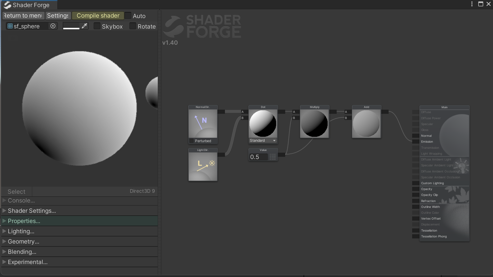
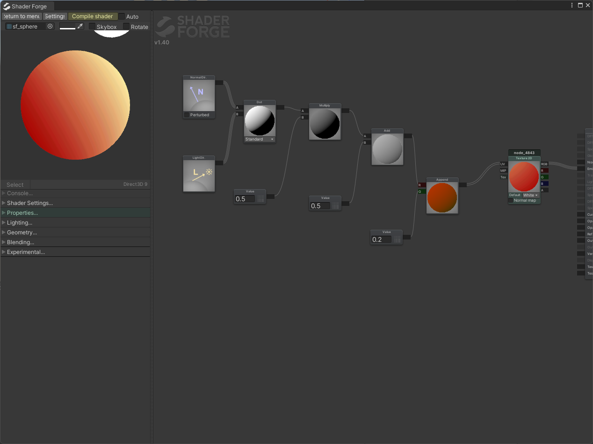

# Technical-Art-Study-Notes
Some of my attempts and notes about my studies in technical art

首次尝试  
实现了一个半Lambert的模型  
  
和庄老师的教程里相比感觉效果并不是很好  
但是后续加上texture之后效果又正常了 
 
这里我遇到的问题是我最开始使用png格式的贴图，在shader里显示是正常的，但是生成材质应用于scene的时候就失效了，后续我找了老师的tga的源文件后实现正常  
（ps：要在shader的节点里看到这种立体的球而不是圆形色块需要关掉Skybox并且在setting里勾上realtime-node-rendering）
