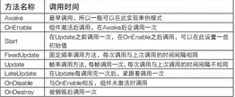
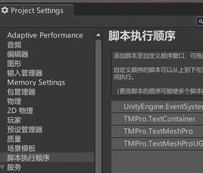
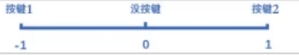

# Unity学习笔记    
### 脚本的生命周期  
主要的两个是方法是start和update，start在第一帧开始前执行，而update则是每一帧执行一次。  
  
脚本的执行顺序除了在生命周期中控制以外，还能够直接在设置中直接进行管理  

### 预制体与变体  
### 欧拉角与四元数 
### Debug功能
#### Debug.DrawLine与Debug.DrawRay  
```C#
Debug.DrawRay  
 public static void DrawRay (Vector3 start, Vector3 dir, Color color= Color.white, float duration= 0.0f,bool depthTest= true);  

Debug.DrawLine  
public static void DrawLine(Vector3 start, Vector3 end, Color color = Color.white, float duration = 0.0f, bool depthTest = true);
```  
区别在于传递的参数中，ray传递的是起点与方向，而line传递的是起点与终点，虽然ray直译过来是射线，但是这里用向量理解会更好，因为在unity中画出来的线是有长度的而不是像数学概念中的射线一样无限延伸，其长度取决于传入dir（方向向量）的长度。  
>ps：画线可以用LineRenderer，或者直接GL画，或者更方便的可以Debug.DrawLine，甚至可以将物理射线画出Debug.DrawRay，但是Debug画出的线只能在调试模式看得到，编译成游戏后将不再出现。
### 动态修改游戏物体
### Applicatio类
### 游戏时间
### 场景类
### 异步加载场景并获取进度  
协程方法异步加载场景
```C#
IEnumerator loadScene(){
    operation = SceneManager.loadSceneAsync(1);
    //加载完场景不自动跳转
    operation.allowSceneActivation = false;
    yield return operation;
}
```
加载的进度
```C#
//0~0.9
operation.progress
```
>ps：0.9到完成一步到位  
### Transform的使用  
常用数据示例 
```C#
//获取位置
transform.position//世界位置 
transform.localPosition//相对位置，相对于父位置
//获取旋转
transform.rotation//四元数
transform.localRotation
transform.eulerAngles//欧拉角
transform.localEulerAngles
//获取缩放
transform.localScale
//向量
transform.forward
transform.right
transform.up
```
常用方法示例
```C#
//看向0点
transform.LookAt(Vector3.zero);
//旋转
transform.Rotate(Vector.up,1);
//绕某个物体旋转
transfoem.RotateAround(Vector3.zero,Vector.up,5);
//移动
transform.Translate(Vector.forward * 0.1f);
```
父子关系
```C#
//获取父物体
transform.parent.gameObject
//子物体个数
transform.childCount
//解除与子物体的父子关系
transform.DetachChildren();
//获取子物体
Transform trans = transform.Find("Child");
//获取第零个子物体
transfoem.GetChild(0)
//判断一个物体是不是另一个物体的子物体
bool res = trans.IsChildOd(transform);
//设置为父物体
trans.SetParent(transform);
```
### PC操作方式（键鼠操作）
键鼠事件需要时刻监听，故需写在update中
```C#
void Update()
{
    //鼠标的点击
    //按下鼠标 0左键 1右键 2滚轮
    if(Input.GetMouseButtonDown(0){
        Debug.log("按下了鼠标左键")；
    })
    if(Input.GetMouseButton(0){
        Debug.log("持续按下鼠标左键")；
    })
    if(Input.GetMouseButtonup(0)){
        Debug.log("抬起鼠标左键");
    }

    //键盘操作
    //按下键盘按键
    Input.GetKeyDown(KeyCode.A)
    //持续按下按键
    Input.GetKey(KeyCode.A)
    //抬起键盘按键
    Input.GetKeyUp(KeyCode.A)
    //(KeyCode.A)--("a")

}
```
### 虚拟轴
简单来说，虚拟轴就是一个数值在-1~1内的数轴，这个数轴上重要的数值就是-1、0和1。当使用按键模拟一个完整的虚拟轴时需要用到两个按键，即将按键1设置为负轴按键，按键2设置为正轴按键。在没有按下任何按键的时候，虚拟轴的数值为0；在按下按键1的时候，虚拟轴的数值会从0~-1进行过渡；在按下按键2的时候，虚拟轴的数值会从0~1进行过渡，如图所示。  
  
虚拟轴的存在可以整合各个操作设备不同的操作方式  
```C#
void Update()
{
    //获取水平轴
    float horizontal = Input.GetAxis("Horizontal")；
    float vertical = Input.GetAxis("Vertical")；
    Debug.Log(horizontal + "   "+ vertical );
    //虚拟按键
    if(Input.GetButtonDown("Jump"))
    {
        Debug.log("空格")；
    }
    /* 同上节各种按键触发方式均可类比实现
    */
}
```